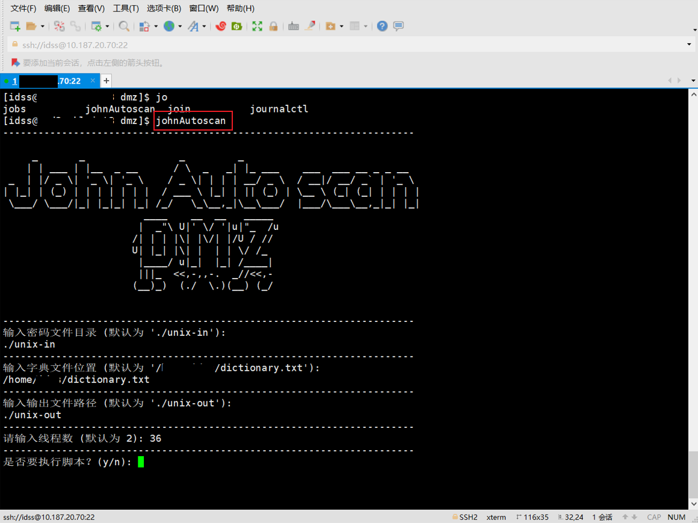

# 密码扫描脚本

一个使用 John the Ripper 工具扫描 Unix 密码文件的 Python 脚本。




## 项目简介

​         这是一个用于执行密码破解的 Python 脚本。它通过调用外部密码破解工具 `john` 来进行破解操作。脚本使用类和方法的方式组织功能，提供了更模块化、可读性更好的代码。


## 版本特性

- **代码结构和模块化：** 该脚本使用了类来组织功能，并将相关的功能划分为类的方法。这种结构使得代码更加模块化，每个功能都有独立的方法进行处理，易于维护和扩展。
- **类封装：** 该脚本将相关的功能封装到类中，使得代码面向对象。这样的封装可以更好地组织代码，减少重复性的代码片段。
- **代码的扩展性：** 该脚本的模块化结构使得未来可以更容易地添加新的功能或进行修改，而不会影响整体代码的稳定性。
- **用户交互优化：** 该脚本对用户交互进行了优化，使用了更友好的提示信息，并且允许用户输入默认值。这使得用户可以更轻松地配置脚本参数。
- **自定义输出路径：** 该脚本可以捕获用户输出路径，当用户输出路径不存在时，自动创建并将文件输出到该路径下，方便后期跟踪和管理。
- **输出结果去重：** 该脚本在执行破解过程中，使用了去重操作，确保输出结果中不会有重复的内容。
- **输出结果显示：** 该脚本在破解完成后，会将输出结果按文件逐一显示，提供用户一个清晰的输出展示。


## 项目结构

该项目的组织结构如下：

- `ascii_art.py`：包含脚本中使用的 ASCII 艺术头部。
- `password_scan.py`：包含负责密码扫描的 `PasswordScan` 类。
- `main.py`：主要执行脚本。


## 使用指南

1. 将此仓库克隆到本地：

```
git clone https://github.com/lrv618/John-Autoscan
```

2. 确保您已安装 Python 3.x。

3. 将脚本添加到环境变量

4. 运行自定义的命令启动脚本


## 示例输出

运行脚本后，您将在指定的输出目录中看到包含扫描结果的输出文件。


## 注意事项

- 本脚本仅供学习和测试使用，不得用于非法活动。
- 请谨慎使用密码破解工具，遵循法律法规，尊重隐私和安全。
